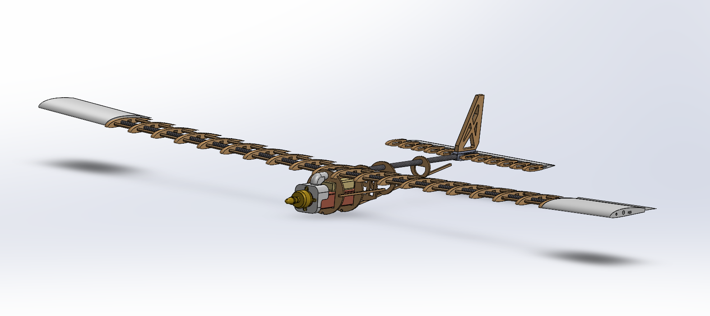
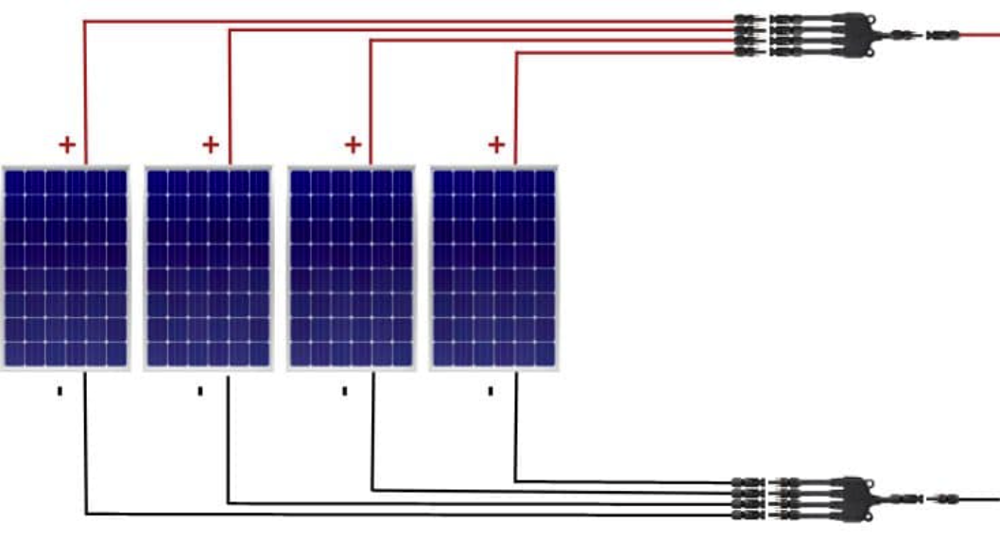

# Helion-RC-Plane
RC aircraft with solar integration

## Short description and how to use:
Helion is an RC plane that me and my friend Elliott plan to custom make and fly. To use our project, you will need a transmitter to control the planes speed and directions. Luckily we already have a transmitter and receiver so we don't have to worry about that step. Next, to actually fly the plane, you will have to go out to a field that allows for rc planes to fly freely unless you want to go through the trouble of registering your vehicle through the FAA. On the field, have one person hold the plane as the other person starts to increase the throttle. Then have have the person holding the plane throw the rc plane and from there it's all up to the person operating the transmitter.

## 3D model in SOLIDWORKS

## Solar pannel wiring

## SOLIDWORKS step file
[Download STEP file](Helion.STEP)
